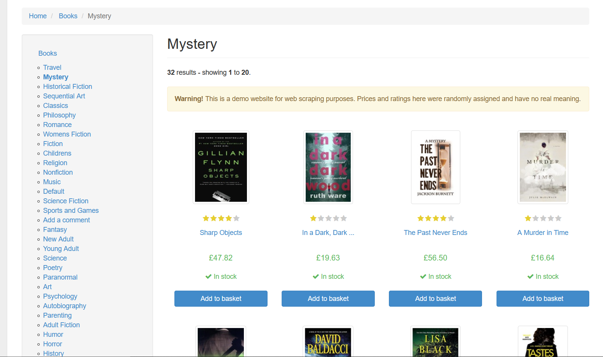
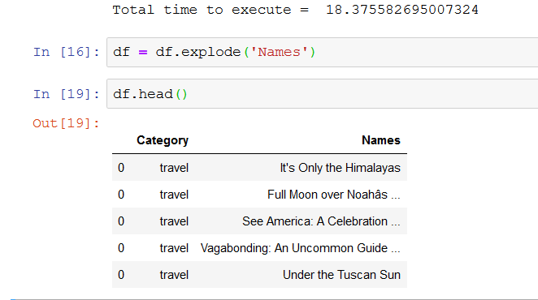

# WebScraping
Data Extraction from the website.
Data is extracted from the website and saved as dataframe. It is usually helpful to scrape the data from the website and analyse the data. In this program, the data is taken from [toscrape.com](http://toscrape.com/) which is web scrapping sandbox. 

### Advantages:
- Converting from unstructured data into structured data
- Usually it takes hours to manually type datapoints (517 rows x 2 columns) but with the help of web scrapping it can be achieved within seconds.

*Note* : Please don't try to scrap more in other websites, some sites may block your ip address to avoid security issues.

### Packages Used:
- Pandas  <- for dataframes
- requests <- it is a http library, I have used to get the raw text from the website URL
- time <- to calculate the execution time
- bs4  <- Beautiful Soup is used to convert the raw text from the site to readable html code

### Result:

- *Unstructured Data from the Book site*

- *Structured Data and the elapsed time to execute*

